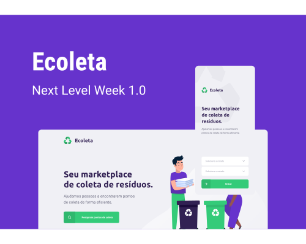

<h1 align="center">
    
</h1>

<h4 align="center">
  NLW - 01: Projeto Ecoleta ♻️
</h4>

<h1 align="center">
    
</h1>

<p align="center">
  <a href="#-tecnologias">Tecnologias</a>&nbsp;&nbsp;&nbsp;|&nbsp;&nbsp;&nbsp;
  <a href="#-projeto">Projeto</a>&nbsp;&nbsp;&nbsp;|&nbsp;&nbsp;&nbsp;
  <a href="#-layout">Layout</a>&nbsp;&nbsp;&nbsp;|&nbsp;&nbsp;&nbsp;
  <a href="#-rodar">Rodar o projeto</a>&nbsp;&nbsp;&nbsp;|&nbsp;&nbsp;&nbsp;
  <a href="#-como-contribuir">Como contribuir</a>&nbsp;&nbsp;&nbsp;|&nbsp;&nbsp;&nbsp;
  <a href="#memo-licença">Licença</a>
</p>

## 🧰 Tecnologias

Esse projeto foi desenvolvido usando as seguintes tecnologias:

- [Node.js](https://nodejs.org/en/)
- [TypeScript](https://www.typescriptlang.org/)
- [React](https://reactjs.org)
- [React Native](https://facebook.github.io/react-native/)
- [Expo](https://expo.io/)

## 💻 Projeto

Ecoleta é um projeto desenvolvido durante a [Next Level Week da Rocketseat](https://nextlevelweek.com/). O objetivo é conectar pessoas com estabelecimentos que coletam resíduos parar reciclagem.

## 📄 Layout

O Layout pode ser visto no [Figma](<https://www.figma.com/file/9TlOcj6l7D05fZhU12xWT3/Ecoleta-(Booster)?node-id=0%3A1>). Para visualizar melhor o layout é necessário possuir uma conta na plataforma.

## 🚀 Rodar o projeto

1 - Faça o clone do projeto
<br/>
2 - Troque aonde está `SEU.IP` por seu IP
<br/>
3 - Executando o Backend:

```bash
# Vá para a pasta
$ cd backend

# Instale as dependências
$ npm install

# Rode o Migration
$ npm run knex:migrate

# ROde Seeds
$ npm run knex:seed

# Start server
$ npm run dev

# Servidor rodando na porta: 3333
```

4 - Executando o Web:

```bash
# Vá para a pasta
$ cd web

# Instale as dependências
$ npm install

# Start server
$ npm start

# Abrirá no navegador a tela inicial
```

5 - Executando o Mobile:

```bash
# Vá para a pasta
$ cd mobile

# Instale as dependências
$ npm install

# Start server
$ npm start

# Abrirá no navegador a página do Expo
```

## 🛠 Como contribuir

- Faça um fork desse repositório;
- Cria uma branch com a sua feature: `git checkout -b minha-feature`;
- Faça commit das suas alterações: `git commit -m 'feat: Minha nova feature'`;
- Faça push para a sua branch: `git push origin minha-feature`.

Depois que o merge da sua pull request for feito, você pode deletar a sua branch.

## 📝 Licença

Esse projeto está sob a licença MIT. Veja o arquivo [LICENSE](LICENSE.md) para mais detalhes.
